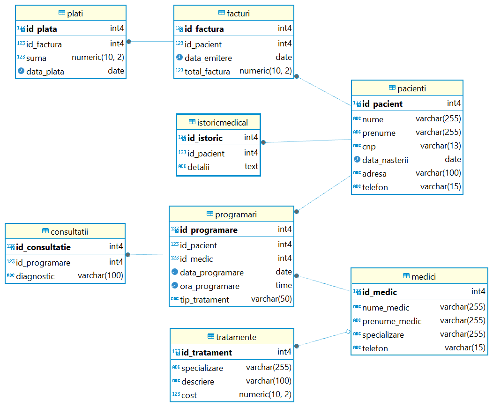

# Project-SQL-and-MongoDB-dental-clinic
University Project - SQL and MongoDB Aggregation Framework - dental clinic

I have created a database for a dental clinic. This database contains 8 tables, each serving a specific role in the efficient management of the clinic's information and the services it offers to patients. The database schema can be found in the SQL_dental_clinic folder.

Schema description:

The "Patients" table stores information about the patients registered at the clinic, such as their unique ID, name, surname, CNP, date of birth, address, and phone number. This information is essential for maintaining a patient registry and ensuring that we can contact them when necessary.

The "Doctors" table records information about the doctors. I should mention that there are 4 doctors at the clinic, each with a different specialization: "General Dentistry," "Orthodontics," "Oral and Maxillofacial Surgery," and "Endodontics." Each doctor also has contact information, such as their first and last name and phone number.

The next table is called "Appointments," which links patients to doctors and stores information about upcoming appointments. It includes the unique appointment ID, patient ID, doctor ID, date and time of the appointment, and the type of treatment scheduled.

We continue with the "Consultations" table, which stores information about the consultations performed during appointments, including the unique appointment ID, the consultation ID, and the diagnosis established by the specialist doctor. For example, following a patient’s appointment for a consultation, Dr. Axinte Alina established a diagnosis of dental caries.

Next, we have the "Treatments" table, which contains information about the different types of treatments available in the clinic, depending on the doctor's specialization. This includes the unique treatment ID, the required specialization, a description of the treatment, and its cost.

We also have the "Medical History" table, which provides details of each patient’s medical history, offering doctors a comprehensive perspective on their past treatments and health conditions.

Finally, we have the "Invoices" table, which manages the invoices issued to patients following treatments, and the "Payments" table, which records the payments made by patients, ensuring that all financial aspects are managed correctly and transparently.

**Database migration to MongoDB**

**pacienti_istoricMed_consultatii** collection contains 3 distinct relational tables. Each document in this collection holds personal details about a patient registered in our clinic, along with two key fields: a document vector called "medical history," which stores information about each patient's medical history, and another document vector called "consultations," which records each patient's consultation appointments, including the diagnosis provided by the doctor.

 ** medici_programari ** collection contains 2 relational tables. Each document in this collection represents a doctor and includes details such as their name, specialization, and a document vector called appointments that lists all of the doctor's appointments, along with references to patients and the type of treatment requested.

Each document in the **tratamente** collection represents a dental treatment offered within a specialization, including a detailed description of the treatment and its cost.

The **facturi_plati** collection combines information about invoices and "payments" (as a vector) into a single document for each transaction, with references to the patient and the services billed.

